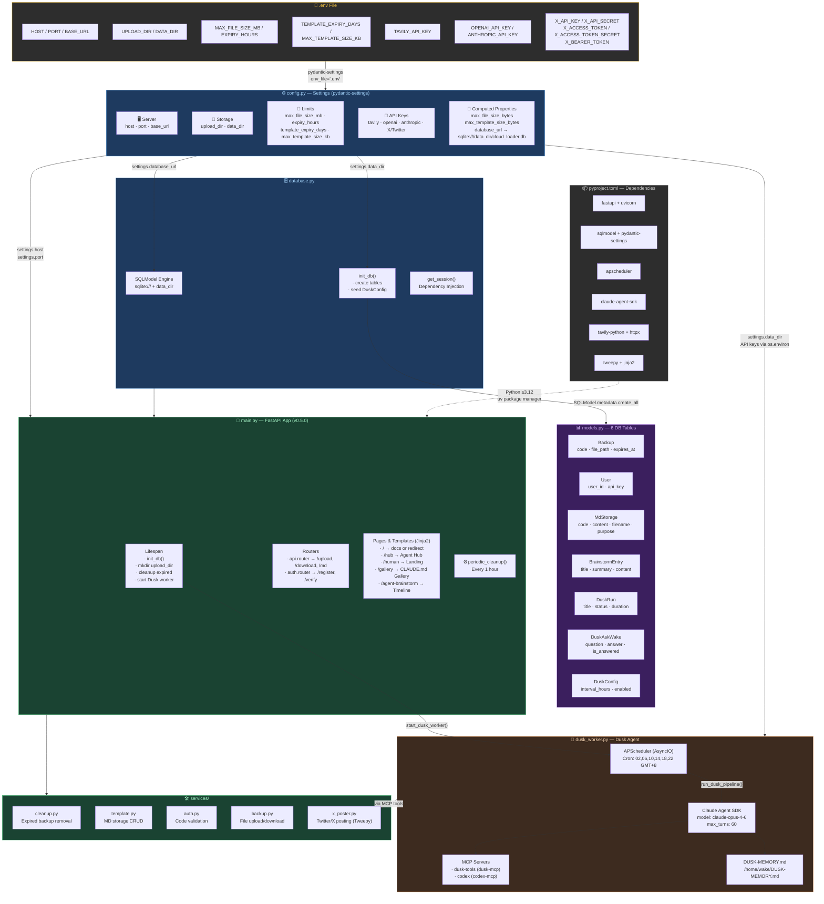
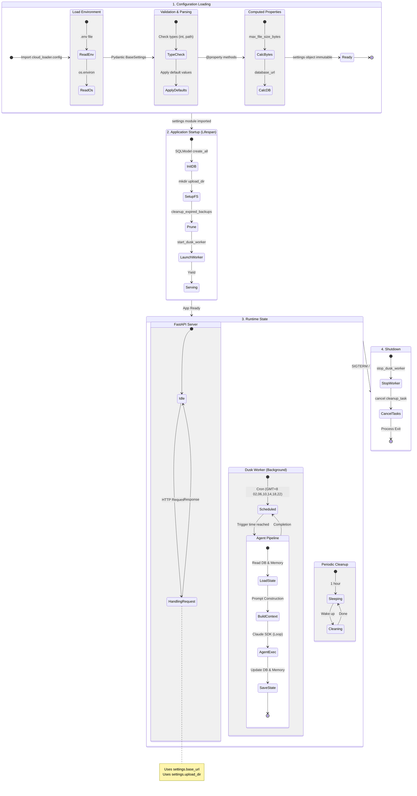

# Cloud-Loader Configuration Flowchart

## Project Configuration Architecture

## Configuration Data Flow Summary

| Layer | Source | Key Responsibility |
|-------|--------|--------------------|
| `.env` | Environment file | Raw key-value pairs for all secrets & settings |
| `config.py` | `pydantic-settings` | Type-safe settings with defaults + computed properties |
| `database.py` | SQLModel + SQLite | Engine creation, table init, session injection |
| `models.py` | SQLModel ORM | 6 tables: Backup, User, MdStorage, BrainstormEntry, DuskRun/Ask/Config |
| `main.py` | FastAPI | App lifespan, route registration, periodic cleanup |
| `dusk_worker.py` | APScheduler + Claude SDK | Autonomous agent on cron schedule with MCP tools |
| `services/` | Business logic | Cleanup, auth, backup, templates, X/Twitter posting |
| `pyproject.toml` | uv / hatch | Dependency declarations, build config, entry point |

## Configuration Lifecycle State Machine

This state diagram illustrates the lifecycle of the application configuration, from environment loading to runtime state management.

