# Cloud-Loader System Flowchart

This flowchart visualizes the core architecture, data flows, and background workers of the Cloud-Loader project.

```mermaid
flowchart TD
    %% Define Actors and External Services
    User[Human User / AI Agent]
    ClaudeAPI[Anthropic Claude API]
    TavilyAPI[Tavily Search API]
    XAPI[X / Twitter API]

    %% Define the Core API
    subgraph CloudLoader["Cloud-Loader API (FastAPI)"]
        direction TB
        RouterMigrate[Migration / File Transfer]
        RouterTemplate[Template Sharing]
        RouterConcept[Concept Tracking]
    end

    %% Define Storage
    subgraph Storage["Local Storage"]
        DB[(SQLite Database)]
        Uploads[./uploads Directory]
    end

    %% Define Background Workers
    subgraph Workers["Background Workers"]
        BrainstormWorker[Brainstorm Worker]
        DuskWorker[Dusk Community Manager]
    end

    %% Interactions with API
    User -- Uploads backup ZIPs --> RouterMigrate
    User -- Downloads via 6-char code --> RouterMigrate
    User -- Shares AGENTS.md / CLAUDE.md --> RouterTemplate
    User -- Manages tracked concepts --> RouterConcept

    %% API to Storage
    RouterMigrate -- Reads/Writes --> Uploads
    RouterMigrate -- Records upload metadata --> DB
    RouterTemplate -- Saves templates --> DB
    RouterConcept -- Queries & Updates --> DB

    %% API to External Services
    RouterConcept -- Fetches Knowledge Graphs --> ClaudeAPI

    %% Workers interactions
    BrainstormWorker -- Reads yesterday's data --> DB
    BrainstormWorker -- Researches trends --> TavilyAPI
    BrainstormWorker -- Summarizes & Strategies --> ClaudeAPI
    BrainstormWorker -- Saves new strategy --> DB

    DuskWorker -- Reads persistent memory --> DB
    DuskWorker -- Researches trends --> TavilyAPI
    DuskWorker -- Generates tweets & replies --> ClaudeAPI
    DuskWorker -- Posts to Community --> XAPI
    DuskWorker -- Updates memory --> DB
```

## How It Works

1. **Migration & Templates**: Users (or AI agents) interact directly with the FastAPI backend to store encrypted configuration files (`AGENTS.md`, `.cursorrules`) or upload ZIP backups. These are given a 6-character verification code and stored either in the database (for templates) or the `./uploads` directory (for files).
2. **Concept Tracking**: Authenticated users can register "concepts" to track. The backend utilizes external AI tools (Claude) to generate knowledge graphs and summaries.
3. **Brainstorm Worker**: Runs daily as a background task. It reads previous strategies from SQLite, fetches new information via Tavily, and writes a newly synthesized strategy back to the database using Claude.
4. **Dusk Worker**: Operates as the professional community manager for the platform. It maintains persistent memory in the database, runs searches via Tavily, and manages the project's Twitter/X presence via the X API.
